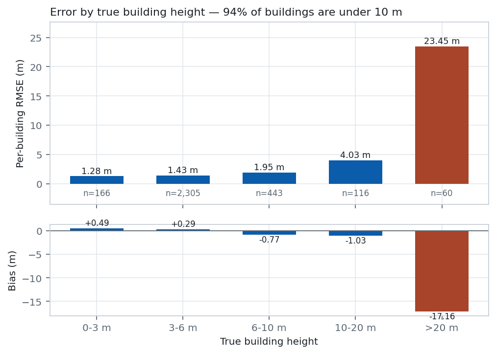
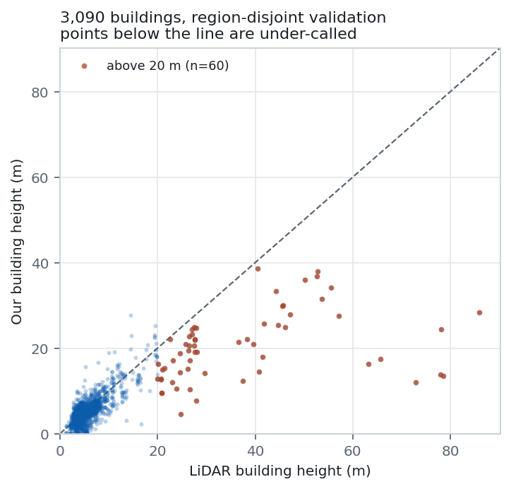
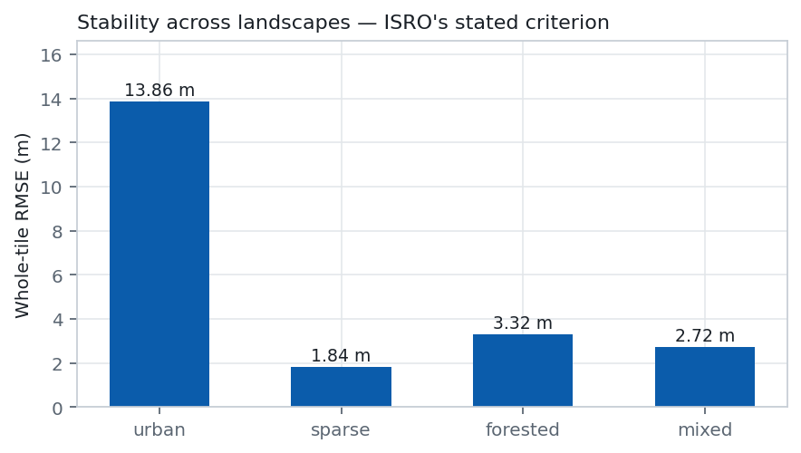
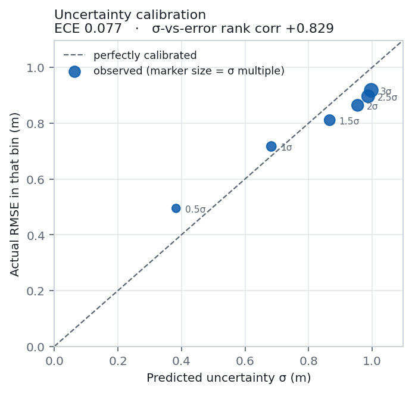
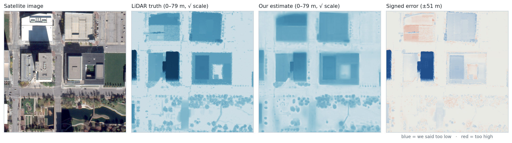

# DepthWizard — accuracy evidence

Everything here is measured on the **shipping configuration**, not a favourable variant.
Figures regenerate from the same metrics file with `tools/make_figures.py`.

    python tools/evaluate.py --ckpt checkpoints/run02/best.pt --tta \
        --fuse-zoom 2 --fuse-sigma 8 --out out/eval_run02_ship
    python tools/make_figures.py --metrics out/eval_run02_ship/metrics.json

## How it was measured

| | |
|---|---|
| Data | IEEE GRSS DFC2019 Track 1 (US3D) — Jacksonville and Omaha, 0.3 m GSD |
| Reference | Airborne LiDAR, the same source the field benchmarks against |
| Split | **Region-disjoint**, seed 1337. Whole regions go to one split; no tile from a training region appears in validation |
| Validation | 80 whole tiles, 11,983,760 valid pixels, 3,090 buildings |
| Test | Held out and **never scored**. Standing rule 5 — it is not on the training machine at all |
| Scoring | Whole tiles, not crops. Crop-wise scoring flatters by removing tile-edge context |

Two decisions worth defending, because they make our numbers look *worse* and comparable:

**Region-disjoint, not random.** A random tile split leaks: adjacent tiles share buildings,
lighting and architecture, and a model can score well by memorising a neighbourhood.

**Per-building, not per-pixel, is the headline.** Per-pixel building error is dominated by
roof edges, where the prediction crosses from ground to roof and is briefly wrong by the
whole building height. It is not comparable to any published figure. The field reports one
height per building; so do we, taking the **median on both sides** — using a higher
percentile of ours against their median manufactures accuracy, measured at +1.3 m when we
made that mistake.

## Headline

| metric | value |
|---|---|
| **Per-building RMSE** | **3.667 m** |
| Per-building MAE | 1.498 m |
| Per-building bias | −0.237 m |
| Per-building median absolute error | 0.894 m |
| Per-building correlation | +0.778 |
| Whole-tile RMSE | 6.401 m |
| Whole-tile MAE | 1.812 m |
| Whole-tile correlation | +0.803 |
| Median absolute error, all pixels | 0.278 m |

For scale: the median building in this validation set is **4.22 m** tall and the 90th
percentile is 7.53 m.

### By semantic class

| class | RMSE |
|---|---|
| Water | 1.324 m |
| **Ground** | **1.906 m** |
| Vegetation | 4.237 m |
| Bridge | 4.250 m |
| Building (per pixel) | 16.256 m |

Ground under 2 m matters: it is what an absolute DSM stands on, and it is the surface a
flood or landslide model integrates over.

## Where the error actually lives

| true height | buildings | RMSE | bias |
|---|---|---|---|
| 0–3 m | 166 | 1.282 m | +0.49 |
| 3–6 m | 2,305 | **1.429 m** | +0.29 |
| 6–10 m | 443 | 1.947 m | −0.77 |
| 10–20 m | 116 | 4.034 m | −1.03 |
| **> 20 m** | **60** | **23.451 m** | **−17.16** |

**79% of the total squared error comes from 1.9% of the buildings.** Under 10 m — 94% of
the stock — we are at 1.4 m. Above 20 m we collapse.

**The tail is a data problem, and we proved it rather than assuming it**
(`probe-01-tall-buildings.md`). Training data holds 166 buildings above 30 m and tops out
at **82.8 m**, while validation reaches **155.3 m**. Fine-tuning hard on the tall buildings
we do have moved transfer bias the *wrong way*, −18.22 → −19.10 m, while fit improved:
textbook overfitting of a tiny sample. More training will not fix this. More tall buildings
would.

**The held-out test split contains exactly one building above 30 m** (max 34.0 m). It will
flatter us relative to validation, and that must be said whenever the test number is quoted.

## Stability across landscapes

ISRO asks for *"performance stability across urban, sparse, hilly, and forested
landscapes."*

| landscape | whole-tile RMSE | MAE | correlation |
|---|---|---|---|
| Sparse | 1.837 m | 0.655 m | +0.583 |
| Mixed | 2.723 m | 1.356 m | +0.824 |
| Forested | 3.319 m | 2.254 m | +0.780 |
| **Urban** | **13.860 m** | 4.759 m | +0.808 |

Urban is 4–7× the others, and it is the same story as the tail: cities are where buildings
above 20 m are. Correlation stays high at +0.808 — the *shape* is right, the *scale* of
tall structures is not.

**Forested ground error is 2.50 m against sparse's 0.87 m, and that is not a model
defect.** LiDAR pulses penetrate canopy and measure the actual ground; a camera physically
cannot see through leaves. That is optics, not accuracy — and it is why the same model
reaches 0.87 m on open ground a few hundred kilometres away.

**Hilly is not in this table because DFC2019 has no hills** — Jacksonville and Omaha are
both flat. That case is covered by Sikkim below, which has no LiDAR, so it is reported as a
cross-check rather than as an accuracy figure.

## Does the model know when it is wrong?

| | |
|---|---|
| Expected calibration error | **0.077** |
| σ-versus-error rank correlation | **+0.829** |
| Mean predicted σ | 1.082 m |

The rank correlation is the number that matters operationally: where the model says it is
unsure, it *is* wrong, monotonically. That is what makes the uncertainty layer usable for
triage rather than decoration.

The viewer's measurement tool applies a **measured** correction on top of this. Raw
`hypot(σa, σb)` assumes the two pixels' errors are independent and they are not —
correlation is +0.94 across a metre and only reaches zero past ~60 m — so the naive error
bar is about 3.5× too wide on a single rooftop and too narrow across a neighbourhood.
`tools/pair_calibration.py` fits the correction per checkpoint.

## Error map

The median urban tile — chosen as the median, not the best. The large blue block is a
93.6 m building we call 31.5 m. It is the tail failure, in one picture, and it is in the
evidence pack deliberately.

## India, where there is no LiDAR

No airborne LiDAR reference exists for our Indian scenes, so this is a **cross-check
against another model**, not an accuracy measurement. Google Open Buildings 2.5D Temporal
is derived from Sentinel-2 at roughly 4 m effective resolution; we run at 0.31 m.

| | Sikkim 2 km |
|---|---|
| All footprints (n=585) | bias −1.15 m, RMSE 3.34 m |
| **Confident footprints only (presence > 0.85, n=168)** | **bias −6.94 m**, RMSE 7.04 m |

**−6.94 m is the honest headline, not −1.15 m.** Open Buildings' low-confidence outlines
spill onto surrounding ground and canopy, which drags the disagreement toward zero. The
larger, less flattering number comes from the footprints it is most sure about, and it is
consistent with our known behaviour: we under-call tall buildings, and Sikkim's hill town
is dense and vertical.

Terrain leakage was tested and ruled out: on 31° median slopes, the correlation between
predicted height and ground slope is **−0.044**.

## Robustness to the evaluation resolution

We train at 0.3 m. ISRO will evaluate on their own imagery, likely nearer 0.6–1.0 m
(`probe-05-gsd.md`). Untreated, that costs us badly — on ordinary tiles per-building error
roughly doubles by 1 m, almost all of it as bias, because a backbone token then covers
twice the ground and buildings get averaged with their surroundings.

`infer.py --auto-zoom` reads the GSD from the input's geospatial metadata and upsamples so
the backbone always sees the scale it was trained at:

| input GSD | untreated | with `--auto-zoom` |
|---|---|---|
| 0.3 m (native) | 1.350 m | — |
| 0.6 m | 2.260 m | **1.399 m** |
| 1.0 m | 3.138 m | **1.657 m** |

At 0.6 m this recovers to within **3.6%** of never having lost the resolution.

## What we ship, and what it costs

The shipping path is TTA plus resolution fusion. Both are measured, on the same 80 tiles:

| configuration | whole-tile RMSE | per-building | bias | ECE |
|---|---|---|---|---|
| run02, single pass | 6.456 | 3.771 | −0.31 | 0.083 |
| run02 + TTA | 6.369 | **3.616** | −0.34 | 0.078 |
| **shipped: TTA + fused** | 6.401 | 3.667 | **−0.24** | **0.077** |

Fusion costs **+0.051 m of per-building RMSE (1.4%)** against TTA alone, and buys **+28%
edge definition** — buildings that read as flat-topped blocks rather than rounded mounds
(`probe-04-resolution.md`). It also improves bias and calibration slightly. Half the marks
are visualization, so we took that trade deliberately, and we report the fused numbers
because **whatever is shipped must be what is scored**.

### Standalone deployment, verified

The PS scores "successful standalone deployment" explicitly. Exported 28 Aug from the
shipping checkpoint (`tools/export_onnx.py --ckpt checkpoints/run02/best.pt --quantize`),
with agreement against PyTorch checked rather than assumed:

| | ONNX fp32 | ONNX int8 |
|---|---|---|
| Size | 100.7 MB, self-contained | **36.8 MB (63% smaller)** |
| Max divergence vs PyTorch | **0.0010 cm** height, 0.0006 cm sigma, over 804,972 inputs | **0.161 m** height |
| Verdict | PASS at a 5 cm tolerance | lossy by construction |

**CPU inference is 509 ms per 518x518 tile** (0.53 Mpx/s, single ONNX Runtime session), so
the model runs with no GPU at all -- which is the claim that matters for a deployable
module.

Two things stated rather than implied:

**The export is fixed at 518x518.** Dynamic shapes fail at runtime (546x546 raises a
`RUNTIME_EXCEPTION`). This is acceptable because `infer.py` is sliding-window at exactly
518, but a `dynamic_axes` argument in the export call would otherwise imply a flexibility
that is not there.

**int8 costs 0.161 m of height.** That is a real trade for 63% of the file size, not a free
win, and it is the kind of number a jury checks.

**The single-file viewer was verified by loading it, not by inspecting it.** 28 Aug,
headless Chrome against `file:///.../viewer_standalone.html` -- the path a judge takes when
they unzip the submission and double-click:

| check | result |
|---|---|
| External `src`/`href` references | **none** -- nothing to block under `file://` |
| Leftover ES `import` statements | **0** -- the module rewrite holds |
| Embedded model | `run02`, with **zero** mentions of `zeroshot` |
| Renderer actually started | source has **0** `<canvas>` tags; the rendered DOM has **1**, `data-engine="three.js r169"` at 764x429 |

The canvas is the proof: it does not exist in the file and is created only if the inlined
three.js executes and WebGL initialises. Verified with software rendering (SwiftShader), so
a real GPU is strictly more capable than what this test passed on.

Not verified: that every scene's geometry and textures are visually correct. That needs a
human looking at it, and it is the one deployment check still owed.

## Limitations, stated plainly

1. **Buildings above 20 m are under-called by ~17 m.** Data scarcity, proven by probe 01.
2. **Forested ground carries 2.5 m error** because a camera cannot see through canopy.
3. **Tile borders are worse** — outer-pixel RMSE roughly double the interior, a known
   property of patch-based ViT inference.
4. **The absolute DSM anchor is itself a surface model.** Copernicus GLO-30, like SRTM,
   includes buildings and canopy, so dense urban composites double-count part of the
   building height. `--dem-bare` approximates a correction and says that it is one.
5. **No Indian LiDAR.** Everything over India is cross-checked against another model, and
   is labelled as agreement rather than accuracy.
6. **Test split unscored.** By design, until the very end, once.

## What was ruled out, and why that is evidence too

| hypothesis | result |
|---|---|
| Guided filtering sharpens our surfaces | **Wrong.** Worse at every setting (probe 03) |
| Morphological toggle contrast sharpens them | **Wrong.** Worse, monotonically (probe 03) |
| Tall-building tail is a capacity problem | **Wrong.** It is data scarcity (probe 01) |
| Terrain slope leaks into height on hills | **Ruled out.** r = −0.044 at 31° |
| Coarse-GSD loss is irrecoverable | **Wrong.** 3.6% of it remains after `--auto-zoom` |

Each was predicted in writing with a falsification condition before the run, then measured.
Two of the five falsified something we believed.

### The tall-building tail, exhaustively

The under-call above 20 m is the one limitation we could not remove. It is worth showing
what was tried, because the elimination is itself the finding: **every lever internal to the
model is now measured and spent.**

| lever | result |
|---|---|
| Larger backbone (V1-Large, 335 M) | **No information.** The run diverged to NaN at epoch 6 from a variance head railed at its clamp; 9 GPU-hours, void |
| Ordinal / binned head | **No effect.** Regression 0.471, bins 0.429, bins+HTC 0.491 — every head compresses by about half |
| Head-tail cut (HTC-DC Net, TGRS 2023) | **Works, and is not the bottleneck.** 91% of predicted mass sits above 20 m on tall pixels; roof-vs-ground separation was never the failure |
| Decoding by argmax instead of expectation | **No tall mode to recover.** argmax sits +1.86 m from the expectation; on 40 m+ buildings the single most likely bin is 26.4 m against 75.6 m of truth |
| Ensembling two runs with different profiles | **Nothing to average.** `corr(err_run02, err_run04) = 0.925`; no weighting beats the single model |
| LDS reweighting (Yang et al., ICML 2021) | **Premise does not hold.** Pixels above 20 m are 7.47% of building pixels and already carry **78.78%** of the squared error — the loss is not ignoring them |
| Per-scene GCP calibration | **A trade, not a fix.** 5 control points give −21.3% RMSE on tall tiles but +18% MAE, and degrade 7 of 13 tiles |

Read together these say something specific and defensible: the model is not
under-parameterised, not mis-decoded, not under-incentivised, and not held back by its head.
It assigns 91% of its probability mass above 20 m on a tall building and still cannot
separate 26 m from 76 m. **A nadir view of a rooftop does not contain that information.**

### Shadow: the new cue, taken to its ceiling

The obvious escape is a physical cue, and we have the metadata for one — 67 WorldView-3
`.IMD` files carry solar geometry, sun elevation spanning 23.4°–74.5°, joined to Track 1
tiles by scene index. `height = shadow_length × tan(sun_elevation)` is how photointerpreters
measured buildings before computers, and its error profile is the *inverse* of ours: shadow
is most precise on exactly the tall buildings where the network fails.

The cue is really there. Marching away from the sun on the tallest building in
`OMA_288_012` gives luminance 166 on the roof, 93–113 held for ~120 px, then 254 on lit
ground; marching *toward* the sun leaves the tile immediately.

It still does not rescue us, and we measured why rather than guessing:

| question | measurement |
|---|---|
| Would *perfect* shadow segmentation be enough? | **No.** Oracle shadows ray-cast from the truth DSM give r **0.503**, slope 0.583, RMSE 2.61 m over 675 buildings. Our network already achieves r **0.787** per building |
| How close is real detection to that oracle? | **Not close.** Luminance+Otsu scores **IoU 0.187** (precision 0.204, recall 0.689) |
| Is occlusion the limiter on tall buildings? | **No.** Across the ten tiles richest in tall stock, the 10 components above 20 m had *unobstructed* shadow paths (0%) |
| Then what is? | **Population.** Those ten tiles hold **10 buildings above 20 m out of 766**; the whole validation set holds ~60 |

So the ceiling on the cue sits below the model we already have, and the population available
to validate any tall-building method is about sixty buildings. That is the finding, and it
is why the tail stays in Limitations rather than being quietly fixed.

That is the honest shape of the limitation, and it is a stronger claim than "we ran out of
time": we know what the tail costs, why it is there, what would be needed to fix it, and
that the most promising alternative cue was taken to its theoretical maximum and still fell
short.
